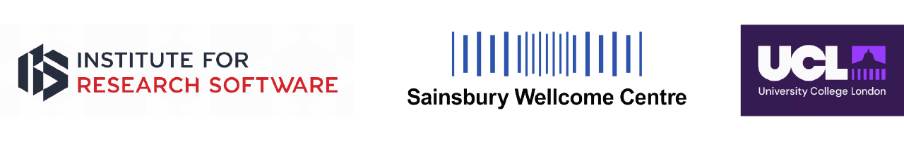
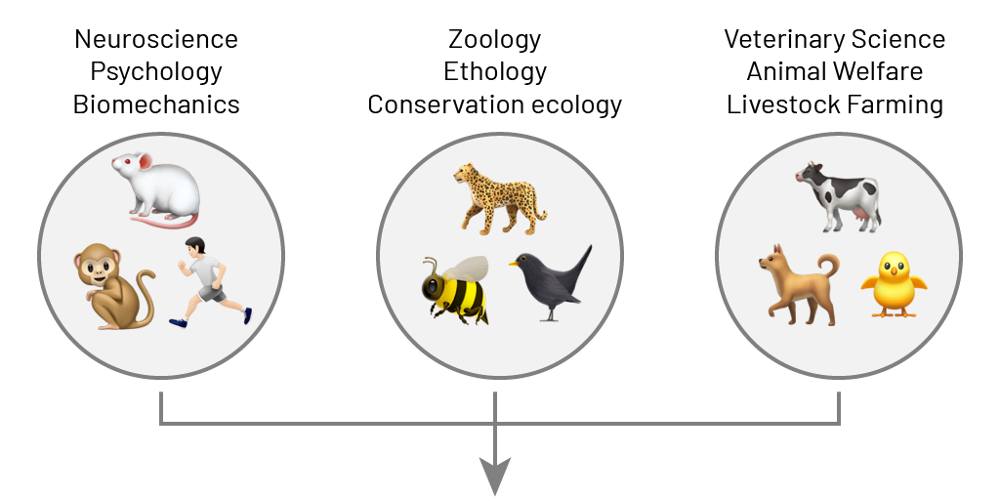
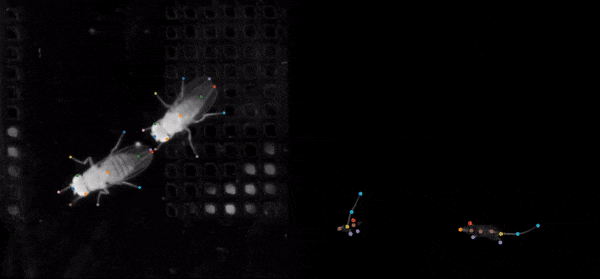
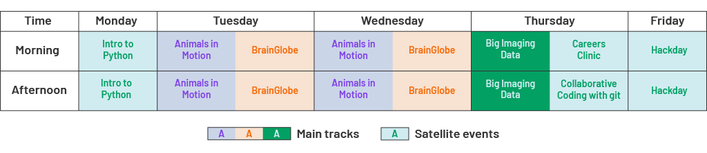
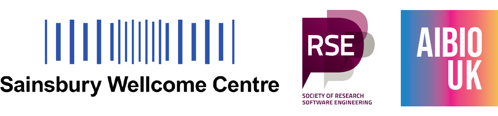
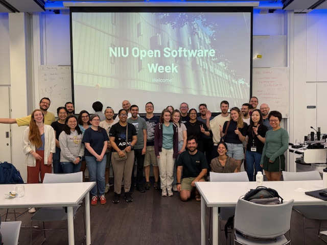
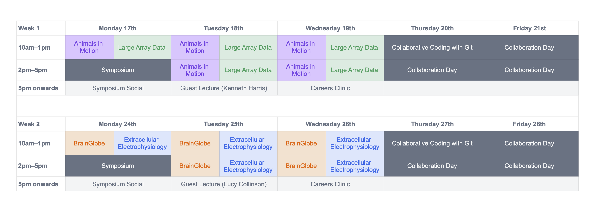
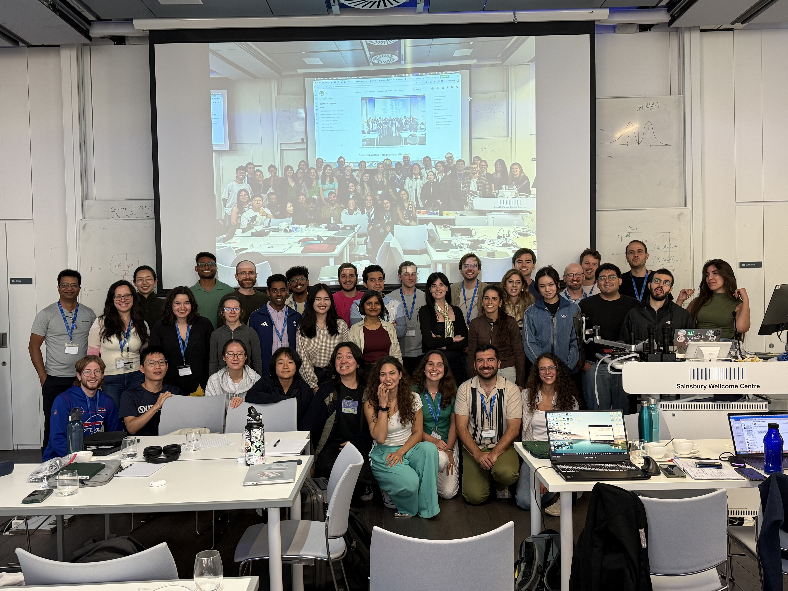

## Who we are {.smaller}

- Institute for Research Software Fellows (2025)
- Senior Research Software Engineers at the [Sainsbury Wellcome Centre](https://www.sainsburywellcome.org/web/) (UCL)
- [Neuroinformatics Unit](https://neuroinformatics.dev/index.html): building open-source software for neuroscience

:::: {.columns}

::: {.column width="50%" .fragment}
**Niko Sirmpilatze** 🐁📹

- Focus on videos of animal behaviour
- Core developer of [movement](https://movement.neuroinformatics.dev/latest/index.html)
:::

::: {.column width="50%" .fragment}
**Alessandro Felder** 🧠🔬

- Focus on whole-brain microscopy
- Core developer of [BrainGlobe](https://brainglobe.info)
- Community-building in bioimage analysis
:::

::::

{fig-align="center"}

## Niko's fellowship {.smaller}

**Animals in Motion**: empowering behavioural researchers with open-source tools

:::: {.columns}
::: {.column width="50%"}
::: {layout="[[70], [30]]" layout-halign="center"}

:::
:::

::: {.column width="50%" .incremental}
- Brought together 24 animal behaviour researchers from diverse fields.
- They were trained by 3 instructors in *using* and *contributing to* relevant open-source tools.
- Open teaching materials made available as [online handbook](https://animals-in-motion.neuroinformatics.dev/).
:::

::::

## Alessandro's fellowship {.smaller}

A bridge between Bioimage analysis and Research Software Community.

::: {.columns}

::: {.column width="50%"}
- Growing (image) data size.
- Need for advocacy around careers.
:::

::: {.column width="50%" .fragment}
- Technical tutorial based on [OME-Zarr textbook](https://ome-zarr-book.readthedocs.io/).
- Community discussion and speed-blogging around career paths.
:::

:::

::: {.fragment}
19 participants, 11 from outside UK, many imaging facility staff.

Maybe (unintentionally) part of a wider strengthening of ties between the communities.
:::

::: {.fragment}
::: {.callout-note}
Also ran a more subdomain-specific BrainGlobe track, with 15 participants.
:::
:::

## Combining fellowships made sense

* We planned to host in the same building.
* Joint socials, hackday and introductory classes.
* Shared administrative burden.

Our main events remained independent.

## The 2025 Open Software Week {.smaller}

- 3 main tracks and 4 shared satellite events
- 44 attendees from 12 countries (8 supported with travel stipends)
- 13 instructors and panellists

## The unexpected benefits of combining {.smaller}

* Accountability partners
* More institutional support & additional funding
* Cross-pollination between participants
* Buy-in from colleagues and invited panellists
* Led to re-usable open teaching materials
* Doubles up as a course for our institute's PhD programme

## Impressions from the 2025 event {.smaller}

::: {.columns}
::: {.column width="50%"}

:::

::: {.column width="50%"}
> My whole PhD feels doable now!

> Atmosphere was very friendly and down to earth.

> The heterogeneity of the attendees was truly enriching.

> It was incredibly valuable to learn directly from the developers and share the space with researchers from across the field.
:::

::::

## Lessons re-learnt

* Select people that REALLY want to come.
* Weave general good-practice training into domain-specific courses.
* Set a friendly tone, using tricks from Collaboration Workshops.

## Sustainability beyond 2025 {.smaller}

- Expanded to 2 weeks in 2026: additional track, more time for collaboration and networking.
- A mixed funding model, combining sponsorship with registrations fees.
- 51 attendees from 16 countries (11 supported with travel stipends) and 17 instructors from 5 institutions.
- Same format planned for 2027.

 

## Impressions from the 2026 event {.smaller}

:::: {.columns}
::: {.column width="50%"}

:::

::: {.column width="50%"}
> The environment is truly encouraging to work on your project and to learn new things!

> The best thing was to talk to other people about our challenges and find solutions together.

> Fantastic content! Very accessible and explained in a great manner.

> It has honestly been the best thing I have done in my PhD.
:::
::::

## Conclusions

- Our fellowships started as separate ideas.
- Combining them into a shared event had many unexpected benefits.
- Institutional buy-in and support from colleagues made it grow into a sustainable, annual summer school.

::: {.fragment}
::: {.callout-tip}
- Read more in our [blogposts](https://www.software.ac.uk/blog/greater-sum-its-parts-establishing-open-software-week-combining-our-ssi-fellowships).
- Keep an eye out for the [2027 summer school](https://neuroinformatics.dev/open-software-summer-school/index.html).
:::
:::

